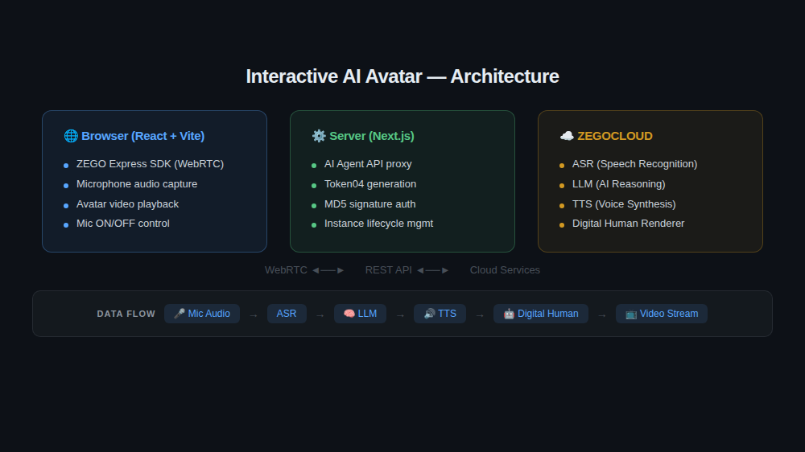

# Interactive AI Avatar

A web-based interactive AI avatar built with ZEGOCLOUD Conversational AI (Digital Human API).

Users can have real-time voice conversations with an AI digital human through their browser.

## Features

- Real-time voice interaction with AI digital human
- WebRTC video streaming for avatar rendering
- Microphone control (mute/unmute)
- Conversation lifecycle management (start/end)

## Tech Stack

- **Frontend**: React + Vite + ZEGO Express SDK
- **Backend**: Next.js API Routes
- **AI**: ZEGOCLOUD Conversational AI (ASR + LLM + TTS + Digital Human)

## Architecture



## Quick Start

### 1. Get ZEGO Credentials

Sign up at [ZEGOCLOUD Console](https://console.zego.im/) to get your App ID and Server Secret.

### 2. Configure Environment

```bash
# Server
cd examples/server
cp .env.example .env
# Edit .env with your APP_ID and SERVER_SECRET

# Frontend
cd examples/web-react
cp .env.example .env
# Edit .env with your VITE_APP_ID
```

### 3. Start the Server

```bash
cd examples/server
npm install
npm run dev
```

### 4. Start the Frontend

```bash
cd examples/web-react
npm install
npm run dev
```

### 5. Open in Browser

Open `http://localhost:5173` and click "Start Conversation" to begin.

## Project Structure

```
examples/
├── server/                    # Next.js backend
│   ├── app/api/
│   │   ├── agent/route.js     # Agent registration (RegisterAgent)
│   │   ├── instance/route.js  # Instance management (CreateDigitalHumanAgentInstance)
│   │   └── token/route.js     # Token04 generation
│   └── .env.example
└── web-react/                 # React + Vite frontend
    ├── src/App.jsx            # Main UI + SDK integration
    └── .env.example
```

## Blog

See [blog-how-to-build-interactive-ai-avatar.md](./blog-how-to-build-interactive-ai-avatar.md) for the companion tutorial article.

## Testing

See [test-cases.md](./test-cases.md) for automated test cases.

## License

MIT
