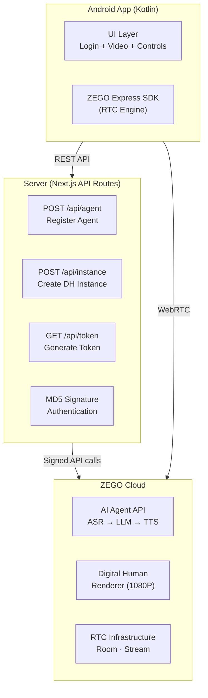
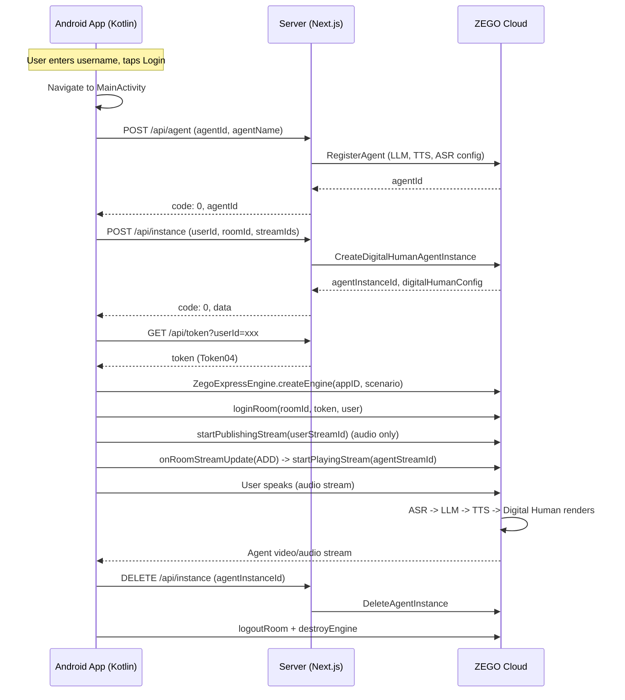

# How to Build an Interactive AI Avatar App for Android

Building an AI avatar that listens, speaks, and responds in real time on Android means chaining speech recognition, language modeling, synthesis, and lip-sync rendering while streaming video to a mobile device. This guide covers the complete architecture and Kotlin code for deploying a voice-interactive digital human on Android, from server API setup to native video rendering.

**Get the complete source code:**
- Android + Web client + server: [ZEGOCLOUD/blog-interactive-ai-avatar](https://github.com/ZEGOCLOUD/blog-interactive-ai-avatar)

The project uses a Kotlin Android client paired with a Next.js API server, which orchestrates the ZEGOCLOUD Conversational AI platform. The Android app handles RTC streaming via the ZEGO Express SDK, while the server manages agent registration, instance creation, and token generation.

### Architecture Overview

The application follows a three-tier architecture that separates the Android client, server, and ZEGO Cloud infrastructure:



The Android client initiates a conversation by calling server APIs to register the agent, create a digital human instance, and obtain an RTC token. It then connects to the RTC room via the ZEGO Express SDK, publishes the user's audio stream, and receives the avatar's video stream. The server never handles media directly, it only orchestrates ZEGO Cloud APIs and generates authentication tokens.



### Preparation

- **Android Studio** with Kotlin support (minimum SDK 24, target SDK 35)
- **Node.js 18+** and npm for running the server
- A [ZEGOCLOUD account](https://console.zegocloud.com/account/login) with App ID and Server Secret
- A digital human avatar ID (use the public test avatar `c4b56d5c-db98-4d91-86d4-5a97b507da97`)
- **ZEGO Express SDK** v3.17.0 for Android
- **OkHttp** 4.12.0 for network requests
- **Gson** 2.10.1 for JSON parsing
- An Android emulator or physical device with microphone access

Server `.env.example`:
```bash
# .env.example
APP_ID=your_app_id_here
SERVER_SECRET=your_32_char_server_secret_here
TOKEN_EXPIRE_SECONDS=3600
```

Android `local.properties.example`:
```properties
# local.properties.example
ZEGO_APP_ID=your_app_id
ZEGO_API_BASE_URL=http://10.0.2.2:3000
```

> **Note:** `10.0.2.2` is the standard localhost address for Android emulators. For physical devices, use the server's LAN IP address instead.

### Step 1: Create the Android Project and Configure Gradle Dependencies

This step sets up the Android project with the ZEGO Express SDK and networking libraries. The Express SDK handles real-time audio and video streaming, OkHttp manages server API calls, and Gson parses JSON responses from the backend.

```kotlin
dependencies {
    // ZEGO Express SDK (RTC) - handles audio/video streaming
    implementation("im.zego:express-video:3.17.0")

    // Network - for server API calls
    implementation("com.squareup.okhttp3:okhttp:4.12.0")

    // JSON - for parsing server responses
    implementation("com.google.code.gson:gson:2.10.1")

    // Material Design - for UI components
    implementation(libs.androidx.material)
    implementation(libs.androidx.core.ktx)
    implementation(libs.androidx.appcompat)
    implementation(libs.androidx.constraintlayout)
}
```

The `build.gradle.kts` also reads `ZEGO_APP_ID` and `ZEGO_API_BASE_URL` from `local.properties` and injects them into `BuildConfig`, so the app can access these values at runtime without hardcoding credentials in source files.

### Step 2: Build the Login Screen

The login screen collects a username that identifies the user in the RTC room. This ID flows through the entire pipeline, it becomes the `userId` parameter in server API calls and the `ZegoUser` object when joining the RTC room. A simple validation prevents empty submissions.

```kotlin
class LoginActivity : AppCompatActivity() {

    private lateinit var etUsername: TextInputEditText

    override fun onCreate(savedInstanceState: Bundle?) {
        super.onCreate(savedInstanceState)
        setContentView(R.layout.activity_login)

        etUsername = findViewById(R.id.etUsername)

        findViewById<MaterialButton>(R.id.btnLogin).setOnClickListener {
            val username = etUsername.text?.toString()?.trim() ?: ""
            if (TextUtils.isEmpty(username)) {
                Toast.makeText(this, "Please enter a username", Toast.LENGTH_SHORT).show()
                return@setOnClickListener
            }

            val intent = Intent(this, MainActivity::class.java)
            intent.putExtra("userId", username)
            startActivity(intent)
        }
    }
}
```


*The login screen presents a minimal interface where users enter a unique ID to join the AI avatar conversation system*

### Step 3: Register the AI Agent via the Server

The Android client calls the server's `/api/agent` endpoint to register an AI agent, which configures the entire AI pipeline in a single request. This includes the language model, text-to-speech provider, and speech recognition service. The server forwards this to the ZEGO AI Agent API with MD5 signature authentication.

```kotlin
private fun registerAgent(): JSONObject? {
    val url = "${BuildConfig.ZEGO_API_BASE_URL}/api/agent"
    val jsonBody = JSONObject().apply {
        put("agentId", AGENT_ID)
        put("agentName", "AI Avatar")
    }

    val request = Request.Builder()
        .url(url)
        .post(jsonBody.toString().toRequestBody(JSON_MEDIA_TYPE))
        .build()

    val response = httpClient.newCall(request).execute()
    val responseBody = response.body?.string() ?: return null
    val result = JSONObject(responseBody)

    if (result.optInt("code", -1) != 0) {
        throw Exception("Register agent failed: ${result.optString("message")}")
    }
    return result
}
```

The server-side registration is idempotent. Calling it multiple times with the same `AgentId` returns code `410001008`, which the server treats as success. Using `"zego_test"` as the API key for LLM and TTS activates the platform's test mode, enabling evaluation of the full pipeline before connecting custom providers.

The server uses MD5 signature authentication to secure all ZEGO API requests:

```javascript
const generateSignature = (appId, serverSecret, signatureNonce, timestamp) => {
  return crypto
    .createHash("md5")
    .update(`${appId}${signatureNonce}${serverSecret}${timestamp}`)
    .digest("hex");
};
```

Each request includes the action name, authentication parameters as query strings, and a JSON body specific to that action, which prevents tampering with request parameters while keeping the implementation straightforward.

### Step 4: Create the Digital Human Instance

Creating a digital human instance connects the AI pipeline to an RTC room for real-time streaming. This call specifies the avatar to render, the RTC room configuration, and conversation history settings. The server handles concurrent limit errors automatically by cleaning up stale instances before retrying.

```kotlin
private fun createInstance(
    userId: String, roomId: String,
    agentStreamId: String, agentUserId: String,
    userStreamId: String
): JSONObject? {
    val url = "${BuildConfig.ZEGO_API_BASE_URL}/api/instance"
    val jsonBody = JSONObject().apply {
        put("agentId", AGENT_ID)
        put("userId", userId)
        put("roomId", roomId)
        put("agentStreamId", agentStreamId)
        put("agentUserId", agentUserId)
        put("userStreamId", userStreamId)
        put("digitalHumanId", DIGITAL_HUMAN_ID)
    }

    val request = Request.Builder()
        .url(url)
        .post(jsonBody.toString().toRequestBody(JSON_MEDIA_TYPE))
        .build()

    val response = httpClient.newCall(request).execute()
    val responseBody = response.body?.string() ?: return null
    val result = JSONObject(responseBody)

    if (result.optInt("code", -1) != 0) {
        throw Exception("Create instance failed: ${result.optString("message")}")
    }
    return result.optJSONObject("data")
}
```

Three parameters matter here. `DigitalHumanId` identifies the avatar to render (use `c4b56d5c-db98-4d91-86d4-5a97b507da97` for the public test avatar). The `ConfigId` defaults to `"web"` for browser rendering, while Android uses `"mobile"` for optimized mobile performance. `EncodeCode: "H264"` ensures device-compatible video encoding. The `MessageHistory` configuration enables multi-turn conversation with a sliding window of 10 messages.

The default concurrent limit is 10 digital human instances per account. The server code handles error codes `410001031` and `410000011` by automatically cleaning up tracked instances and retrying the creation request.

### Step 5: Generate the RTC Token and Initialize the Express Engine

The Android client requests a ZEGO Token04 from the server to authenticate with the RTC infrastructure. After receiving the token, it creates the Express Engine and joins the RTC room. The engine initialization uses the `HIGH_QUALITY_CHATROOM` scenario, which applies audio optimizations for voice interaction and avoids requesting camera permissions.

```kotlin
private fun createEngine() {
    val profile = ZegoEngineProfile()
    profile.appID = BuildConfig.ZEGO_APP_ID
    profile.scenario = ZegoScenario.HIGH_QUALITY_CHATROOM
    profile.application = application
    engine = ZegoExpressEngine.createEngine(profile, null)
}

private fun getToken(userId: String): String? {
    val url = "${BuildConfig.ZEGO_API_BASE_URL}/api/token?userId=$userId"

    val request = Request.Builder()
        .url(url)
        .get()
        .build()

    val response = httpClient.newCall(request).execute()
    val responseBody = response.body?.string() ?: return null
    val result = JSONObject(responseBody)
    return result.optString("token")
}
```

The server generates the token using AES-CBC encryption with the 32-character server secret. The `04` prefix identifies this as Token version 4, which the ZEGO RTC infrastructure uses to select the correct decryption algorithm. Token expiry defaults to 3600 seconds.


*The main page shows a video placeholder area and the Start Conversation button before the AI avatar connects*

### Step 6: Join the Room, Publish Audio, and Receive the Avatar Stream

After creating the engine and setting event handlers, the app logs into the RTC room with the token, starts publishing audio (with camera disabled for voice-only interaction), and listens for the avatar's video stream via the `onRoomStreamUpdate` callback. When the avatar starts streaming, the app automatically renders it into the `TextureView`.

```kotlin
private fun loginRoom(roomId: String, token: String, agentStreamId: String, userStreamId: String) {
    val user = ZegoUser(userId, userId)
    val roomConfig = ZegoRoomConfig()
    roomConfig.token = token
    roomConfig.isUserStatusNotify = true

    engine?.loginRoom(roomId, user, roomConfig) { errorCode, _ ->
        if (errorCode == 0) {
            startPublishingStream(userStreamId)
        } else {
            updateStatus("Login failed: $errorCode")
            cleanupLocal()
        }
    }
}

private fun startPublishingStream(streamId: String) {
    engine?.enableCamera(false)       // No video, only audio
    engine?.muteMicrophone(false)     // Enable mic
    engine?.startPublishingStream(streamId)
}
```

The event handler detects when the avatar's stream becomes available:

```kotlin
engine?.setEventHandler(object : IZegoEventHandler() {
    override fun onRoomStreamUpdate(
        roomID: String?, updateType: ZegoUpdateType,
        streamList: ArrayList<ZegoStream>?, extendedData: org.json.JSONObject?
    ) {
        if (updateType == ZegoUpdateType.ADD) {
            streamList?.forEach { stream ->
                currentStreamId = stream.streamID
                startPlayingStream(stream.streamID)
            }
        } else if (updateType == ZegoUpdateType.DELETE) {
            streamList?.forEach { stream ->
                engine?.stopPlayingStream(stream.streamID)
            }
        }
    }
})

private fun startPlayingStream(streamId: String) {
    runOnUiThread {
        val canvas = ZegoCanvas(videoView)
        engine?.startPlayingStream(streamId, canvas)
        tvPlaceholder.visibility = View.GONE
        isConnected = true
        updateStatus("Playing")
        updateButtons()
    }
}
```

The `onRoomStreamUpdate` callback fires when the digital human starts or stops streaming, so the app automatically renders the avatar's video into the `TextureView` without manual intervention. Setting the `ZegoScenario.HIGH_QUALITY_CHATROOM` scenario enables audio 3A processing (AEC, AGC, ANS) optimized for voice interaction.


*The main page during an active conversation shows the AI avatar video stream with Mic ON/OFF and End Conversation controls*

### Step 7: Microphone Control and Conversation Cleanup

Toggling the microphone and tearing down resources properly are essential for a polished user experience. The `muteMicrophone` method toggles audio capture without destroying the stream, which avoids re-requesting microphone permissions on unmute. The cleanup function releases all SDK resources in reverse order and deletes the server-side agent instance.

```kotlin
private fun toggleMic() {
    isMicOn = !isMicOn
    engine?.muteMicrophone(!isMicOn)

    runOnUiThread {
        if (isMicOn) {
            btnMic.text = getString(R.string.mic_on)
            btnMic.setBackgroundColor(ContextCompat.getColor(this, R.color.btn_mic_on))
        } else {
            btnMic.text = getString(R.string.mic_off)
            btnMic.setBackgroundColor(ContextCompat.getColor(this, R.color.btn_mic_off))
        }
    }
}

private fun endConversation() {
    Thread {
        try {
            agentInstanceId?.let { deleteInstance(it) }
            runOnUiThread { cleanupLocal() }
            updateStatus("Ready")
        } catch (e: Exception) {
            runOnUiThread { cleanupLocal() }
            updateStatus("Ready")
        }
    }.start()
}

private fun cleanupLocal() {
    currentStreamId?.let { engine?.stopPlayingStream(it) }
    engine?.stopPublishingStream()
    engine?.logoutRoom()
    ZegoExpressEngine.destroyEngine(null)
    engine = null
    isConnected = false
    isMicOn = true
    agentInstanceId = null
    currentRoomId = null
    currentStreamId = null

    runOnUiThread {
        tvPlaceholder.visibility = View.VISIBLE
        updateButtons()
    }
}
```

The `endConversation` method deletes the agent instance on the server, then unpublishes the stream, leaves the room, and destroys the engine on the client. The `onDestroy` lifecycle callback also handles cleanup when the activity is destroyed, ensuring no orphaned resources remain on either side.

### Running the Application

Start the server and build the Android client:

```bash
# Terminal 1: Server
cd examples/server
npm install && npm run dev

# Terminal 2: Android
cd examples/android
./gradlew assembleDebug
adb install app/build/outputs/apk/debug/app-debug.apk
```

Configure `local.properties` with your ZEGO App ID and the server URL (use `http://10.0.2.2:3000` for emulator, or your LAN IP for physical devices). The app launches at the login screen, where you enter a username and tap Login. On the main page, tap "Start Conversation" to initialize the AI avatar.

| Troubleshooting Issue | Solution |
|---|---|
| "ZEGO_APP_ID not configured" | Add `ZEGO_APP_ID` to `local.properties` or set `ZEGO_APPID` env var |
| "Login failed" error code | Check that the server is running and `ZEGO_API_BASE_URL` points to it |
| "Register agent failed" | Verify `APP_ID` and `SERVER_SECRET` in the server `.env` file |
| Concurrent limit reached | The server auto-cleans stale instances, but check the dashboard for active instances |
| No video after connection | The digital human takes 1-2 seconds to start streaming after instance creation |

## Conclusion

An interactive AI avatar on Android no longer requires stitching separate ASR, LLM, TTS, and rendering services. ZEGOCLOUD's Conversational AI platform unifies the pipeline behind three server APIs and the ZEGO Express SDK, delivering sub-1.5-second end-to-end latency with 1080P digital human rendering. The patterns in this guide deploy a production-ready digital human in a single Kotlin Activity and three Next.js API routes, suitable for customer service, virtual companions, or live commerce on mobile devices.

## FAQ

### Q: What latency can I expect from the ai avatar pipeline on Android?

The end-to-end response latency is under 1.5 seconds, covering speech recognition, LLM reasoning, text-to-speech synthesis, and lip-sync rendering. The driving latency from audio or text input to the digital human response is under 200 milliseconds.

### Q: Can I use custom LLM and TTS providers for my ai avatar instead of the defaults?

The RegisterAgent API accepts custom LLM endpoints (any OpenAI-compatible API) and TTS vendor configurations, so swapping providers requires no changes to the streaming infrastructure. During testing, using `"zego_test"` as the API key enables evaluation of the full pipeline before connecting custom services.

### Q: How many concurrent ai avatar instances can run on a single ZEGOCLOUD account?

Each ZEGOCLOUD account supports up to 10 concurrent digital human instances by default, with the server code including automatic cleanup of stale instances when the limit is reached. Contact ZEGOCLOUD support to increase the concurrent limit for production deployments.

### Q: Does the ai avatar app work on real Android devices as well as emulators?

The ZEGO Express SDK supports physical Android devices running API level 24 and above, with full microphone access and hardware-accelerated video decoding. For emulators, use `10.0.2.2` as the server address, while physical devices need the server's LAN IP.

### Q: What happens if the microphone permission is denied in the ai avatar app?

The app requests `RECORD_AUDIO` permission at runtime before starting a conversation, and displays a toast message explaining that voice interaction requires microphone access. The visual experience continues without audio input if permission is denied.

## Demo Video

Watch the interactive AI avatar in action:

<!-- VIDEO_PLACEHOLDER: 待插入演示视频 -->