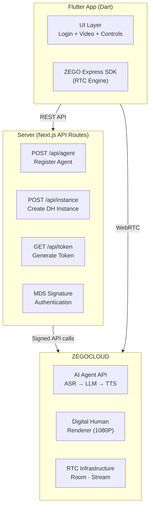
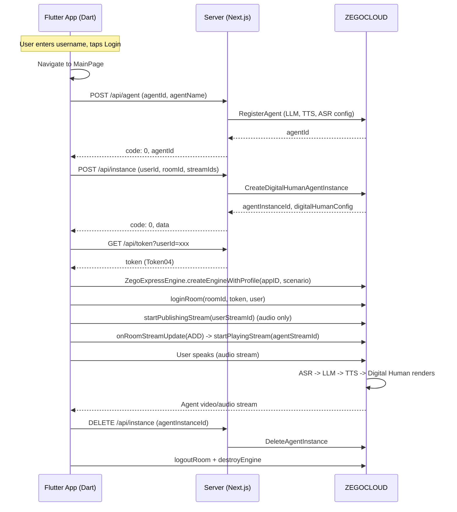

# How to Build an Interactive AI Avatar App with Flutter

Building an AI avatar that listens, speaks, and responds in real time on Flutter means chaining speech recognition, language modeling, synthesis, and lip-sync rendering while streaming video to a mobile device. This guide covers the complete architecture and Dart code for deploying a voice-interactive digital human on Flutter, from server API setup to native video rendering.

**Get the complete source code:**
- Flutter + Android + Web client + server: [ZEGOCLOUD/blog-interactive-ai-avatar](https://github.com/ZEGOCLOUD/blog-interactive-ai-avatar)


The project uses a Flutter Dart client paired with a Next.js API server, which orchestrates the ZEGOCLOUD Conversational AI platform. The Flutter app handles RTC streaming via the ZEGO Express SDK, while the server manages agent registration, instance creation, and token generation.

### Architecture Overview

The application follows a three-tier architecture that separates the Flutter client, server, and ZEGOCLOUD infrastructure:



The Flutter client initiates a conversation by calling server APIs to register the agent, create a digital human instance, and obtain an RTC token. It then connects to the RTC room via the ZEGO Express SDK, publishes the user's audio stream, and receives the avatar's video stream. The server never handles media directly, it only orchestrates ZEGOCLOUD APIs and generates authentication tokens.



### Preparation

- **Flutter 2.0+** with Dart SDK 3.11.5 or above
- **Android Studio** with Flutter plugin (Android 4.4+, recommend real device)
- **Xcode** for iOS builds (iOS 12.0+, recommend real device)
- **Node.js 18+** and npm for running the server
- A [ZEGOCLOUD account](https://console.zegocloud.com/account/login) with App ID and Server Secret
- A digital human avatar ID (use the public test avatar `c4b56d5c-db98-4d91-86d4-5a97b507da97`)
- **ZEGO Express SDK** v3.10.3 for Flutter
- **http** 1.2.0 for network requests
- **flutter_dotenv** 5.2.1 for environment configuration
- **permission_handler** 11.3.1 for runtime permissions

Server `.env.example`:
```bash
# .env.example
APP_ID=your_app_id_here
SERVER_SECRET=your_32_char_server_secret_here
TOKEN_EXPIRE_SECONDS=3600
```

Flutter `.env.example`:
```bash
# .env.example
ZEGO_APPID=your_app_id
ZEGO_API_BASE_URL=http://10.0.2.2:3000
```

> **Note:** `10.0.2.2` is the standard localhost address for Android emulators. For iOS simulators, use `http://localhost:3000`. For physical devices, use the server's LAN IP address.

### Step 1: Create the Flutter Project and Configure Dependencies

This step sets up the Flutter project with the ZEGO Express SDK and networking libraries. The Express SDK handles real-time audio and video streaming, the http package manages server API calls, and flutter_dotenv loads configuration from a `.env` file.

```yaml
dependencies:
  flutter:
    sdk: flutter
  zego_express_engine: ^3.10.3
  http: ^1.2.0
  flutter_dotenv: ^5.2.1
  permission_handler: ^11.3.1
```

After adding these to `pubspec.yaml`, run `flutter pub get` to fetch the packages. The `zego_express_engine` package provides the RTC engine for audio/video streaming, while `permission_handler` manages runtime microphone access on both Android and iOS.

### Step 2: Configure Android Permissions

The ZEGO Express SDK requires specific Android permissions for audio capture, network access, and Bluetooth connectivity. These permissions go in the `AndroidManifest.xml` file, and the app also requests `RECORD_AUDIO` at runtime via the permission_handler package.

```xml
<!-- Permissions required by the SDK -->
<uses-permission android:name="android.permission.ACCESS_WIFI_STATE" />
<uses-permission android:name="android.permission.RECORD_AUDIO" />
<uses-permission android:name="android.permission.INTERNET" />
<uses-permission android:name="android.permission.ACCESS_NETWORK_STATE" />
<uses-permission android:name="android.permission.BLUETOOTH" />
<uses-permission android:name="android.permission.MODIFY_AUDIO_SETTINGS" />
<uses-permission android:name="android.permission.CAMERA" />

<!-- Permissions required by the Demo App -->
<uses-permission android:name="android.permission.READ_PHONE_STATE" />
<uses-permission android:name="android.permission.WRITE_EXTERNAL_STORAGE" />
<uses-permission android:name="android.permission.WAKE_LOCK" />

<uses-feature android:glEsVersion="0x00020000" android:required="true" />
<uses-feature android:name="android.hardware.camera" />
<uses-feature android:name="android.hardware.camera.autofocus" />
```

The `RECORD_AUDIO` and `CAMERA` permissions are the most critical for voice interaction. Android 6.0+ requires dynamic permission requests for these, which the permission_handler plugin handles at runtime. The `READ_PHONE_STATE` permission lets the SDK pause audio during phone calls, and only needs the manifest declaration without a runtime request.

### Step 3: Build the Login Screen

The login screen collects a username that identifies the user in the RTC room. This ID flows through the entire pipeline, becoming the `userId` parameter in server API calls and the `ZegoUser` object when joining the RTC room. A simple validation prevents empty submissions.

```dart
class LoginPage extends StatefulWidget {
  const LoginPage({super.key});

  @override
  State<LoginPage> createState() => _LoginPageState();
}

class _LoginPageState extends State<LoginPage> {
  final _usernameController = TextEditingController();

  void _login() {
    final username = _usernameController.text.trim();
    if (username.isEmpty) {
      ScaffoldMessenger.of(context).showSnackBar(
        const SnackBar(content: Text('Please enter a username')),
      );
      return;
    }
    Navigator.pushReplacementNamed(
      context,
      '/main',
      arguments: username,
    );
  }

  @override
  Widget build(BuildContext context) {
    return Scaffold(
      body: SafeArea(
        child: Padding(
          padding: const EdgeInsets.all(24),
          child: Column(
            mainAxisAlignment: MainAxisAlignment.center,
            crossAxisAlignment: CrossAxisAlignment.stretch,
            children: [
              const Text(
                'AI Avatar Demo',
                textAlign: TextAlign.center,
                style: TextStyle(
                  fontSize: 28,
                  fontWeight: FontWeight.bold,
                  color: Color(0xFF00D9FF),
                ),
              ),
              const SizedBox(height: 48),
              TextField(
                controller: _usernameController,
                decoration: InputDecoration(
                  labelText: 'Username',
                  hintText: 'Enter your username',
                  filled: true,
                  fillColor: const Color(0xFF16213E),
                  border: OutlineInputBorder(
                    borderRadius: BorderRadius.circular(8),
                    borderSide: BorderSide.none,
                  ),
                ),
                style: const TextStyle(color: Colors.white),
                onSubmitted: (_) => _login(),
              ),
              const SizedBox(height: 24),
              ElevatedButton(
                onPressed: _login,
                style: ElevatedButton.styleFrom(
                  backgroundColor: const Color(0xFF00D9FF),
                  foregroundColor: Colors.black,
                  minimumSize: const Size.fromHeight(48),
                ),
                child: const Text('Login'),
              ),
            ],
          ),
        ),
      ),
    );
  }
}
```

The `Navigator.pushReplacementNamed` call passes the username to the main page via route arguments, which prevents the user from navigating back to the login screen during an active conversation.


### Step 4: Register the AI Agent via the Server

The Flutter client calls the server's `/api/agent` endpoint to register an AI agent, which configures the entire AI pipeline in a single request. This includes the language model, text-to-speech provider, and speech recognition service. The server forwards this to the ZEGO AI Agent API with MD5 signature authentication.

```dart
Future<void> _registerAgent() async {
  final url = Uri.parse('$apiBaseUrl/api/agent');
  final response = await http.post(
    url,
    headers: {'Content-Type': 'application/json'},
    body: jsonEncode({
      'agentId': agentId,
      'agentName': 'AI Avatar',
    }),
  );

  final result = jsonDecode(response.body) as Map<String, dynamic>;
  if (result['code'] != 0) {
    throw Exception('Register agent failed: ${result['message']}');
  }
}
```

The server-side registration is idempotent. Calling it multiple times with the same `AgentId` returns code `410001008`, which the server treats as success. Using `"zego_test"` as the API key for LLM and TTS activates the platform's test mode, enabling evaluation of the full pipeline before connecting custom providers.

The server uses MD5 signature authentication to secure all ZEGO API requests:

```javascript
const generateSignature = (appId, serverSecret, signatureNonce, timestamp) => {
  return crypto
    .createHash("md5")
    .update(`${appId}${signatureNonce}${serverSecret}${timestamp}`)
    .digest("hex");
};
```

Each request includes the action name, authentication parameters as query strings, and a JSON body specific to that action, which prevents tampering with request parameters while keeping the implementation straightforward.

### Step 5: Create the Digital Human Instance

Creating a digital human instance connects the AI pipeline to an RTC room for real-time streaming. This call specifies the avatar to render, the RTC room configuration, and conversation history settings. The server handles concurrent limit errors automatically by cleaning up stale instances before retrying.

```dart
Future<Map<String, dynamic>?> _createInstance(
  String userId,
  String roomId,
  String agentStreamId,
  String agentUserId,
  String userStreamId,
) async {
  final url = Uri.parse('$apiBaseUrl/api/instance');
  final response = await http.post(
    url,
    headers: {'Content-Type': 'application/json'},
    body: jsonEncode({
      'agentId': agentId,
      'userId': userId,
      'roomId': roomId,
      'agentStreamId': agentStreamId,
      'agentUserId': agentUserId,
      'userStreamId': userStreamId,
      'digitalHumanId': digitalHumanId,
    }),
  );

  final result = jsonDecode(response.body) as Map<String, dynamic>;
  if (result['code'] != 0) {
    throw Exception('Create instance failed: ${result['message']}');
  }
  return result['data'] as Map<String, dynamic>?;
}
```

Three parameters matter here. `DigitalHumanId` identifies the avatar to render (use `c4b56d5c-db98-4d91-86d4-5a97b507da97` for the public test avatar). `ConfigId` defaults to `"web"` for browser rendering. `EncodeCode: "H264"` ensures device-compatible video encoding. The `MessageHistory` configuration enables multi-turn conversation with a sliding window of 10 messages.

The default concurrent limit is 10 digital human instances per account. The server code handles error codes `410001031` and `410000011` by automatically cleaning up tracked instances and retrying the creation request.

### Step 6: Generate the RTC Token and Initialize the Express Engine

The Flutter client requests a ZEGO Token04 from the server to authenticate with the RTC infrastructure. After receiving the token, it creates the Express Engine and prepares the canvas view for video rendering. The engine initialization uses the `General` scenario with Token-based authentication, which avoids embedding the AppSign in the client.

```dart
class ZegoService {
  ZegoExpressEngine? _engine;
  bool isEngineCreated = false;

  Future<void> createEngine(int appID) async {
    if (isEngineCreated) return;

    final profile = ZegoEngineProfile(
      appID,
      ZegoScenario.General,
      appSign: '', // Using Token auth, not AppSign
      enablePlatformView: false, // Use TextureRenderer on Android
    );

    await ZegoExpressEngine.createEngineWithProfile(profile);
    _engine = ZegoExpressEngine.instance;
    isEngineCreated = true;
  }
}
```

Setting `enablePlatformView: false` selects TextureRenderer on Android, which uses fewer resources and offers better stability compared to PlatformView. The server generates the token using AES-256-CBC encryption with the 32-character server secret. The `04` prefix identifies this as Token version 4, which the ZEGO RTC infrastructure uses to select the correct decryption algorithm. Token expiry defaults to 3600 seconds.

```dart
Future<String?> _getToken(String userId) async {
  final url = Uri.parse('$apiBaseUrl/api/token?userId=$userId');
  final response = await http.get(url);
  final result = jsonDecode(response.body) as Map<String, dynamic>;
  return result['token'] as String?;
}
```


### Step 7: Join the Room, Publish Audio, and Receive the Avatar Stream

After creating the engine and setting event handlers, the app logs into the RTC room with the token, starts publishing audio (with camera disabled for voice-only interaction), and listens for the avatar's video stream via the `onRoomStreamUpdate` callback. When the avatar starts streaming, the app automatically renders it into the canvas view.

```dart
Future<void> startConversation() async {
  // Check audio permission first
  final status = await Permission.microphone.request();
  if (!status.isGranted) {
    _updateStatus('Audio permission is required for voice interaction');
    return;
  }

  // Step 1: Register agent
  await _registerAgent();

  // Step 2: Generate IDs
  final timestamp = DateTime.now().millisecondsSinceEpoch;
  final roomId = 'room_$timestamp';
  final userStreamId = 'user_stream_${userId}_$timestamp';
  final agentStreamId = 'agent_stream_$timestamp';
  final agentUserId = 'agent_user_$timestamp';

  // Step 3: Create digital human instance
  final instanceData = await _createInstance(
    userId, roomId, agentStreamId, agentUserId, userStreamId,
  );
  agentInstanceId = instanceData?['agentInstanceId'] as String?;

  // Step 4: Get token
  final token = await _getToken(userId);

  // Step 5: Create ZEGO engine
  await _zegoService.createEngine(appID);

  // Step 5b: Create canvas view AFTER engine
  await _initCanvasView();

  // Step 6: Set event handlers
  _setEventHandlers();

  // Step 7: Login room
  final loginResult = await _zegoService.loginRoom(roomId, userId, token);
  if (loginResult.errorCode != 0) {
    _updateStatus('Login failed: ${loginResult.errorCode}');
    _cleanupLocal();
    return;
  }

  // Step 8: Start publishing audio
  _zegoService.startPublishingStream(userStreamId);
}
```

The event handler detects when the avatar's stream becomes available:

```dart
void _setEventHandlers() {
  _zegoService.setOnRoomStreamUpdate((roomID, updateType, streamList, extendedData) {
    if (updateType == ZegoUpdateType.Add) {
      for (final stream in streamList) {
        currentAgentStreamId = stream.streamID;
        _startPlayingAgentStream(stream.streamID);
      }
    } else if (updateType == ZegoUpdateType.Delete) {
      for (final stream in streamList) {
        _zegoService.stopPlayingStream(stream.streamID);
      }
    }
  });
}

void _startPlayingAgentStream(String streamId) {
  if (_playViewID != null) {
    _zegoService.startPlayingStream(streamId, _playViewID!);
  } else {
    // Fallback: audio only
    _zegoService.startPlayingStreamAudioOnly(streamId);
  }

  setState(() {
    isConnected = true;
    isMicOn = true;
  });
  _updateStatus('Playing');
}
```

The `onRoomStreamUpdate` callback fires when the digital human starts or stops streaming, so the app automatically renders the avatar's video into the TextureView without manual intervention. If the canvas view is not ready, the app falls back to audio-only playback, ensuring the conversation continues even if video rendering encounters an issue.

The `ZegoService` class wraps the core SDK calls for room operations, publishing, and playing:

```dart
// Login room with Token
Future<ZegoRoomLoginResult> loginRoom(String roomId, String userId, String token) async {
  final user = ZegoUser.id(userId);
  final config = ZegoRoomConfig.defaultConfig();
  config.token = token;
  config.isUserStatusNotify = true;
  return ZegoExpressEngine.instance.loginRoom(roomId, user, config: config);
}

// Start publishing audio stream (voice-only, no camera)
void startPublishingStream(String streamId) {
  ZegoExpressEngine.instance.enableCamera(false);
  ZegoExpressEngine.instance.muteMicrophone(false);
  ZegoExpressEngine.instance.startPublishingStream(streamId);
}

// Start playing stream with canvas view
void startPlayingStream(String streamId, int viewID) {
  final canvas = ZegoCanvas.view(viewID);
  ZegoExpressEngine.instance.startPlayingStream(streamId, canvas: canvas);
}
```

Setting `enableCamera(false)` before publishing prevents the SDK from capturing video, which avoids unnecessary bandwidth consumption for a voice-only interaction. The `muteMicrophone(false)` call ensures the mic is active when the conversation starts.


### Step 8: Microphone Control and Conversation Cleanup

Toggling the microphone and tearing down resources properly are essential for a polished user experience. The `muteMicrophone` method toggles audio capture without destroying the stream, which avoids re-requesting microphone permissions on unmute. The cleanup function releases all SDK resources in reverse order and deletes the server-side agent instance.

```dart
void toggleMic() {
  setState(() {
    isMicOn = !isMicOn;
  });
  _zegoService.muteMicrophone(!isMicOn);
}

Future<void> endConversation() async {
  try {
    // Delete agent instance on server
    if (agentInstanceId != null) {
      await _deleteInstance(agentInstanceId!);
    }
  } catch (e) {
    debugPrint('Delete instance error: $e');
  }

  _cleanupLocal();
  _updateStatus('Ready');
}

void _cleanupLocal() {
  // Stop playing stream
  if (currentAgentStreamId != null) {
    _zegoService.stopPlayingStream(currentAgentStreamId!);
  }

  // Stop publishing
  _zegoService.stopPublishingStream();

  // Logout room
  _zegoService.logoutRoom();

  // Destroy engine
  _zegoService.destroyEngine();

  // Reset state
  setState(() {
    isConnected = false;
    isMicOn = true;
    agentInstanceId = null;
    currentAgentStreamId = null;
    _playViewWidget = null;
    _playViewID = null;
  });
}
```

The `endConversation` method deletes the agent instance on the server, then unpublishes the stream, leaves the room, and destroys the engine on the client. The `PopScope` widget also intercepts the back button during an active conversation, calling `endConversation` to ensure cleanup happens even if the user navigates away unexpectedly.

### Running the Application

Start the server and the Flutter client:

```bash
# Terminal 1: Server
cd examples/server
npm install && npm run dev

# Terminal 2: Flutter
cd examples/flutter
flutter pub get
flutter run
```

Configure the `.env` file with your ZEGO App ID and the server URL (use `http://10.0.2.2:3000` for Android emulator, `http://localhost:3000` for iOS simulator, or your LAN IP for physical devices). The app launches at the login screen, where you enter a username and tap Login. On the main page, tap "Start Conversation" to initialize the AI avatar.

| Troubleshooting Issue | Solution |
|---|---|
| "ZEGO_APPID not configured" | Add `ZEGO_APPID` to the `.env` file in the Flutter project root |
| "Login failed" error code | Check that the server is running and `ZEGO_API_BASE_URL` points to it |
| "Register agent failed" | Verify `APP_ID` and `SERVER_SECRET` in the server `.env` file |
| Concurrent limit reached | The server auto-cleans stale instances, but check the dashboard for active instances |
| No video after connection | The digital human takes 1-2 seconds to start streaming after instance creation |
| Microphone permission denied | The app requests permission at runtime; check device settings if denied |
| TextureView crash on Android | Update to Flutter 1.24+ which fixes the SurfaceTexture race condition |

## Conclusion

An interactive AI avatar on Flutter no longer requires stitching separate ASR, LLM, TTS, and rendering services. ZEGOCLOUD's Conversational AI platform unifies the pipeline behind three server APIs and the ZEGO Express SDK, delivering sub-1.5-second end-to-end latency with 1080P digital human rendering. The patterns in this guide deploy a production-ready digital human in a single Flutter widget tree and three Next.js API routes, suitable for customer service, virtual companions, or live commerce on mobile devices.

## FAQ

### Q: What latency can I expect from the ai avatar pipeline on Flutter?

The end-to-end response latency is under 1.5 seconds, covering speech recognition, LLM reasoning, text-to-speech synthesis, and lip-sync rendering. The driving latency from audio or text input to the digital human response is under 200 milliseconds.

### Q: Can I use custom LLM and TTS providers for my ai avatar instead of the defaults?

The RegisterAgent API accepts custom LLM endpoints (any OpenAI-compatible API) and TTS vendor configurations, so swapping providers requires no changes to the streaming infrastructure. During testing, using `"zego_test"` as the API key enables evaluation of the full pipeline before connecting custom services.

### Q: How many concurrent ai avatar instances can run on a single ZEGOCLOUD account?

Each ZEGOCLOUD account supports up to 10 concurrent digital human instances by default, with the server code including automatic cleanup of stale instances when the limit is reached. Contact ZEGOCLOUD support to increase the concurrent limit for production deployments.

### Q: Does the ai avatar Flutter app work on both Android and iOS?

The ZEGO Express SDK for Flutter supports Android 4.4+ and iOS 12.0+ with full microphone access and hardware-accelerated video rendering via TextureRenderer. Both platforms use the same Dart codebase, with platform-specific configuration limited to permissions and the server URL.

### Q: What happens if the microphone permission is denied in the ai avatar app?

The app requests microphone permission at runtime before starting a conversation, and displays a status message explaining that voice interaction requires microphone access. The visual experience continues without audio input if permission is denied, since the avatar video stream plays independently of the local audio capture.

## Demo Video

Watch the interactive AI avatar in action:

<!-- VIDEO_PLACEHOLDER: 待插入演示视频 -->
