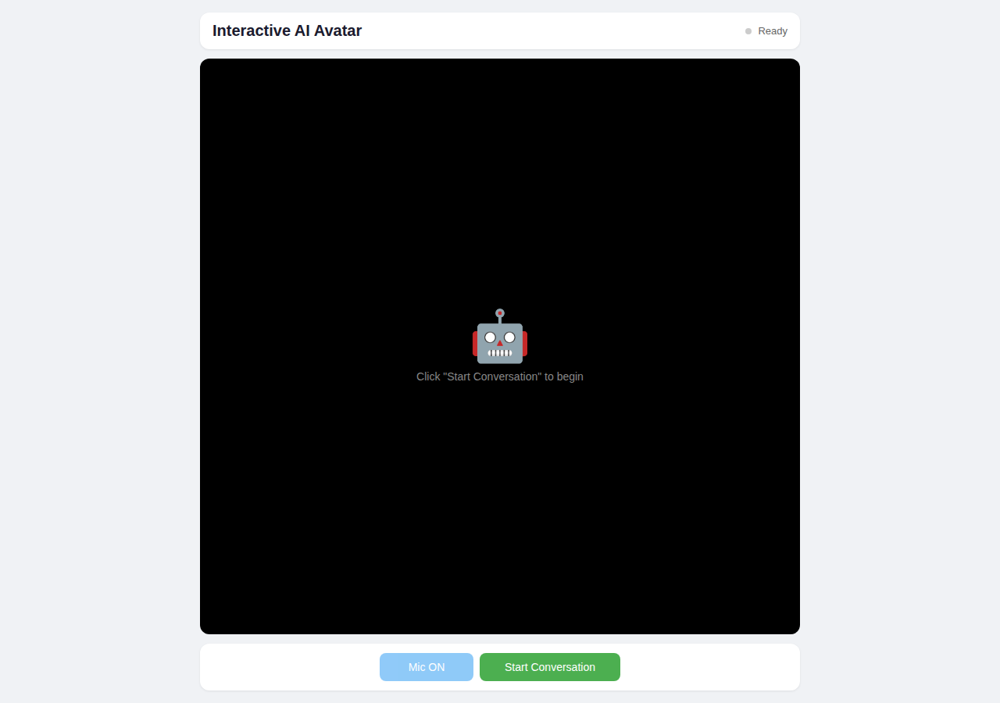
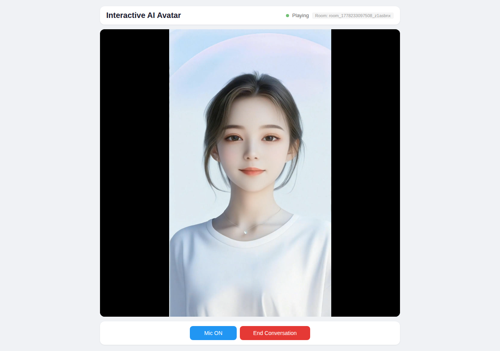

# How to Build an Interactive AI Avatar

Building an ai avatar that speaks, listens, and responds in real time requires orchestrating multiple AI services with low-latency video streaming. ZEGOCLOUD's Conversational AI solution provides a server-driven architecture that chains ASR, LLM, TTS, and digital human rendering into a single real-time pipeline. With sub-1.5-second end-to-end response latency and WebRTC video delivery, it lets developers deploy lifelike voice-interactive digital humans without managing separate AI services. This guide walks through the complete architecture and production-ready code for deploying interactive digital humans on the web, from server API authentication to browser-side video rendering.

## How to Build an Interactive AI Avatar

There is a peculiar irony in building real-time systems: the faster they must respond, the more carefully their architecture must be designed. An interactive digital human chains four AI services in sequence (speech recognition, language modeling, speech synthesis, and lip-sync rendering) while streaming video to a browser. Getting this right requires clean separation between the server, which handles authentication and API orchestration, and the client, which manages the WebRTC connection and UI state.

### Architecture Overview

The application follows a three-tier architecture that separates concerns between the browser, server, and ZEGOCLOUD infrastructure:

```
┌─────────────────────────────────────────────────────┐
│  Browser (React + Vite)                             │
│  ┌──────────────┐    ┌─────────────────────────┐   │
│  │  UI Layer     │    │  ZEGO Express SDK       │   │
│  │  Status       │    │  (WebRTC Engine)        │   │
│  │  Video        │    │                         │   │
│  │  Mic Toggle   │    │                         │   │
│  └──────────────┘    └─────────────────────────┘   │
└─────────────────────────────────────────────────────┘
         │                        │
         │ REST API calls         │ WebRTC
         ▼                        ▼
┌─────────────────────────────────────────────────────┐
│  Server (Next.js API Routes)                        │
│  ┌────────────────┐  ┌────────────────┐            │
│  │ POST /api/     │  │ POST /api/     │            │
│  │ agent          │  │ instance       │            │
│  └────────────────┘  └────────────────┘            │
│  ┌────────────────┐  ┌────────────────┐            │
│  │ GET /api/      │  │ MD5 Signature  │            │
│  │ token          │  │ Authentication │            │
│  └────────────────┘  └────────────────┘            │
└─────────────────────────────────────────────────────┘
         │                        │
         ▼                        ▼
┌─────────────────────────────────────────────────────┐
│  ZEGOCLOUD                                           │
│  ┌────────────────┐  ┌────────────────────────┐    │
│  │ AI Agent API   │  │ RTC Infrastructure     │    │
│  └────────────────┘  │ Room · Stream · Relay  │    │
│  ┌────────────────┐  └────────────────────────┘    │
│  │ AI Pipeline    │  ┌────────────────────────┐    │
│  │ ASR → LLM →   │  │ Digital Human          │    │
│  │ TTS → Lip-Sync│  │ Renderer (1080P)       │    │
│  └────────────────┘  └────────────────────────┘    │
└─────────────────────────────────────────────────────┘
```

The browser initiates a conversation by calling server APIs to register the agent, create a digital human instance, and obtain an RTC token. It then connects to the RTC room via the ZEGO Express SDK, publishes the user's audio stream, and receives the avatar's video stream in real time. The server never handles media directly; it only orchestrates the ZEGOCLOUD APIs and generates authentication tokens.

### Prerequisites

Before starting, ensure the following are in place:

- **Node.js 18+** and npm installed
- A [ZEGOCLOUD account](https://console.zegocloud.com/account/login) with App ID and Server Secret
- A digital human avatar ID (use the public test avatar `c4b56d5c-db98-4d91-86d4-5a97b507da97`)

The project structure separates server and client code:

```
examples/
├── server/                    # Next.js backend
│   ├── app/api/
│   │   ├── agent/route.js     # Agent registration
│   │   ├── instance/route.js  # Instance create/delete
│   │   └── token/route.js     # Token generation
│   └── .env                   # APP_ID, SERVER_SECRET
└── web-react/                 # React + Vite frontend
    ├── src/App.jsx            # UI + SDK logic
    └── .env                   # VITE_APP_ID, VITE_API_BASE_URL
```

### Step 1: Server API Authentication

All requests to the ZEGOCLOUD AI Agent API require MD5 signature authentication. The signature combines the App ID, a random nonce, the server secret, and a Unix timestamp into an MD5 hash, which prevents tampering with request parameters while keeping the implementation straightforward.

```javascript
import crypto from "crypto";

const generateSignature = (appId, serverSecret, signatureNonce, timestamp) => {
  return crypto
    .createHash("md5")
    .update(`${appId}${signatureNonce}${serverSecret}${timestamp}`)
    .digest("hex");
};

const sendAgentRequest = async (action, body) => {
  const appId = Number(process.env.APP_ID || process.env.ZEGO_APPID || 0);
  const serverSecret = process.env.SERVER_SECRET || process.env.ZEGO_SERVER_SECRET || "";
  const timestamp = Math.floor(Date.now() / 1000);
  const signatureNonce = crypto.randomBytes(8).toString("hex");
  const signature = generateSignature(appId, serverSecret, signatureNonce, timestamp);

  const url = new URL("https://aigc-aiagent-api.zegotech.cn/");
  url.searchParams.set("Action", action);
  url.searchParams.set("AppId", appId.toString());
  url.searchParams.set("SignatureNonce", signatureNonce);
  url.searchParams.set("Timestamp", timestamp.toString());
  url.searchParams.set("Signature", signature);
  url.searchParams.set("SignatureVersion", "2.0");

  const response = await fetch(url.toString(), {
    method: "POST",
    headers: { "Content-Type": "application/json" },
    body: JSON.stringify(body),
  });
  return await response.json();
};
```

The `sendAgentRequest` function serves as the foundation for all subsequent API calls. Each request includes the action name, authentication parameters as query strings, and a JSON body specific to that action.

### Step 2: Register the AI Agent

The `RegisterAgent` API configures the entire AI pipeline in a single call. This is where the avatar's language model, voice, and speech recognition provider are defined.

```javascript
// POST /api/agent
export const POST = async (request) => {
  const body = await request.json();
  const agentId = body.agentId || "ai_avatar_agent";
  const agentName = body.agentName || "AI Avatar";

  const result = await sendAgentRequest("RegisterAgent", {
    AgentId: agentId,
    Name: agentName,
    LLM: {
      Url: "https://ark.cn-beijing.volces.com/api/v3/chat/completions",
      ApiKey: "zego_test",
      Model: "doubao-1-5-pro-32k-250115",
      SystemPrompt: "You are a friendly AI avatar assistant. Answer concisely.",
    },
    TTS: {
      Vendor: "ByteDance",
      Params: {
        app: {
          appid: "zego_test",
          token: "zego_test",
          cluster: "volcano_tts",
        },
        audio: {
          voice_type: "zh_female_wanwanxiaohe_moon_bigtts",
        },
      },
    },
    ASR: {
      Vendor: "Tencent",
    },
  });

  if (result.Code === 0 || result.Code === 410001008) {
    return NextResponse.json({ code: 0, agentId });
  }
  return NextResponse.json({ code: result.Code }, { status: 500 });
};
```

The registration is idempotent: calling it multiple times with the same `AgentId` returns code `410001008`, which the server treats as success. During development, using `"zego_test"` as the API key for LLM and TTS activates the platform's test mode, enabling evaluation of the full pipeline before connecting custom providers.

### Step 3: Create the Digital Human Instance

Once the agent is registered, creating a digital human instance connects the AI pipeline to an RTC room for real-time streaming. This call specifies which avatar to render, the RTC room configuration, and conversation history settings.

```javascript
// POST /api/instance
export const POST = async (request) => {
  const body = await request.json();

  const result = await sendAgentRequest("CreateDigitalHumanAgentInstance", {
    AgentId: body.agentId,
    UserId: body.userId,
    RTC: {
      RoomId: body.roomId,
      AgentStreamId: body.agentStreamId,
      AgentUserId: body.agentUserId,
      UserStreamId: body.userStreamId,
    },
    DigitalHuman: {
      DigitalHumanId: body.digitalHumanId,
      ConfigId: "web",
      EncodeCode: "H264",
    },
    MessageHistory: {
      SyncMode: 1,
      Messages: [],
      WindowSize: 10,
    },
  });

  if (result.Code === 0) {
    return NextResponse.json({
      code: 0,
      data: { agentInstanceId: result.Data?.AgentInstanceId },
    });
  }
  return NextResponse.json({ code: result.Code }, { status: 500 });
};
```

Three parameters deserve attention. `DigitalHumanId` identifies the avatar to render (use `c4b56d5c-db98-4d91-86d4-5a97b507da97` for the public test avatar). `ConfigId: "web"` optimizes rendering for browser playback. `EncodeCode: "H264"` ensures browser-compatible video encoding. The `MessageHistory` configuration enables multi-turn conversation with a sliding window of 10 messages.

The production code also handles concurrent limit errors (codes `410001031` and `410000011`) by automatically cleaning up stale instances and retrying, which prevents transient failures from breaking the user experience.

### Step 4: Generate the RTC Token

The browser needs a ZEGO Token04 to authenticate with the RTC infrastructure. This token uses AES-CBC encryption with the 32-character server secret, encoding the app ID, user ID, nonce, and expiration time into a binary format prefixed with `04`.

```javascript
import { createCipheriv } from "crypto";

const makeRandomIv = () => {
  const chars = "0123456789abcdefghijklmnopqrstuvwxyz";
  const out = [];
  for (let i = 0; i < 16; i += 1) {
    out.push(chars.charAt(Math.floor(Math.random() * chars.length)));
  }
  return out.join("");
};

const getAlgorithm = (key) => {
  const length = Buffer.from(key).length;
  if (length === 16) return "aes-128-cbc";
  if (length === 24) return "aes-192-cbc";
  if (length === 32) return "aes-256-cbc";
  throw new Error(`Invalid ServerSecret length: ${length}`);
};

const generateToken04 = (appId, userId, secret, effectiveTimeInSeconds) => {
  const tokenInfo = {
    app_id: appId,
    user_id: userId,
    nonce: Math.ceil(-2147483648 + 4294967295 * Math.random()),
    ctime: Math.floor(Date.now() / 1000),
    expire: Math.floor(Date.now() / 1000) + effectiveTimeInSeconds,
    payload: "",
  };

  const iv = makeRandomIv();
  const cipher = createCipheriv(getAlgorithm(secret), secret, iv);
  cipher.setAutoPadding(true);
  const encryptBuf = Buffer.concat([
    cipher.update(JSON.stringify(tokenInfo)),
    cipher.final(),
  ]);

  // Binary format: [expire(8B)][ivLen(2B)][iv][encLen(2B)][encrypted]
  const b1 = new Uint8Array(8);
  const b2 = new Uint8Array(2);
  const b3 = new Uint8Array(2);
  new DataView(b1.buffer).setBigInt64(0, BigInt(tokenInfo.expire), false);
  new DataView(b2.buffer).setUint16(0, iv.length, false);
  new DataView(b3.buffer).setUint16(0, encryptBuf.byteLength, false);

  const buf = Buffer.concat([
    Buffer.from(b1), Buffer.from(b2), Buffer.from(iv),
    Buffer.from(b3), Buffer.from(encryptBuf),
  ]);

  return `04${Buffer.from(buf).toString("base64")}`;
};

// GET /api/token?userId=xxx
export const GET = async (request) => {
  const appId = Number(process.env.APP_ID || process.env.ZEGO_APPID || 0);
  const serverSecret = process.env.SERVER_SECRET || process.env.ZEGO_SERVER_SECRET || "";
  const userId = new URL(request.url).searchParams.get("userId");
  const token = generateToken04(appId, userId, serverSecret, 3600);
  return NextResponse.json({ token });
};
```

The binary format packs the expiration timestamp, IV length, IV, encrypted payload length, and encrypted payload into a single buffer before Base64 encoding. The `04` prefix identifies this as Token version 4, which the ZEGO RTC infrastructure uses to select the correct decryption algorithm.

### Step 5: Frontend Connection and Streaming

The React frontend orchestrates the entire flow: register agent, create instance, get token, initialize the RTC engine, join the room, publish audio, and receive the avatar's video stream.

```jsx
const startConversation = async () => {
  const userId = generateId("user");
  const roomId = generateId("room");
  const userStreamId = generateId("user_stream");
  const agentStreamId = generateId("agent_stream");
  const agentUserId = generateId("agent_user");

  // Step 1: Register agent
  await fetch(`${apiBaseUrl}/api/agent`, {
    method: "POST",
    headers: { "Content-Type": "application/json" },
    body: JSON.stringify({ agentId: "ai_avatar_agent", agentName: "AI Avatar" }),
  });

  // Step 2: Create digital human instance
  const instanceRes = await fetch(`${apiBaseUrl}/api/instance`, {
    method: "POST",
    headers: { "Content-Type": "application/json" },
    body: JSON.stringify({
      agentId: "ai_avatar_agent", userId, roomId,
      agentStreamId, agentUserId, userStreamId,
      digitalHumanId: "c4b56d5c-db98-4d91-86d4-5a97b507da97",
    }),
  });

  // Step 3: Get RTC token
  const tokenRes = await fetch(`${apiBaseUrl}/api/token?userId=${userId}`);
  const { token } = await tokenRes.json();

  // Step 4: Initialize ZEGO Express SDK
  const { ZegoExpressEngine } = await import("zego-express-engine-webrtc");
  const engine = new ZegoExpressEngine(appId, "");

  // Listen for agent's video stream
  engine.on("roomStreamUpdate", async (roomID, updateType, streamList) => {
    if (updateType === "ADD") {
      for (const stream of streamList) {
        const mediaStream = await engine.startPlayingStream(stream.streamID, {
          jitterBufferTarget: 500,
        });
        const remoteView = engine.createRemoteStreamView(mediaStream);
        remoteView.play("remote-video", { enableAutoplayDialog: false });
      }
    }
  });

  // Step 5: Login room
  await engine.loginRoom(roomId, token, { userID: userId, userName: userId });

  // Step 6: Publish local audio
  const localStream = await engine.createZegoStream({
    camera: { video: false, audio: true },
  });
  await engine.startPublishingStream(userStreamId, localStream);
};
```

The `roomStreamUpdate` event fires when the digital human starts streaming, and the avatar's video automatically renders into the `#remote-video` DOM element. Setting `jitterBufferTarget: 500` minimizes playback latency for real-time interaction. The audio stream creation gracefully fails in environments without microphone access, allowing the visual experience to continue without voice input.





### Step 6: Microphone Control and Cleanup

Toggling the microphone and tearing down resources properly are essential for a polished experience. The cleanup function releases all SDK resources in reverse order and deletes the server-side agent instance.

```jsx
// Mic toggle: mute/unmute the local audio stream
const toggleMic = () => {
  const engine = engineRef.current;
  if (!engine) return;
  const newMicState = !isMicOn;
  engine.muteMicrophone(!newMicState);
  setIsMicOn(newMicState);
};

// End conversation: clean up all resources in reverse order
const endConversation = async () => {
  const engine = engineRef.current;
  if (engine) {
    engine.stopPublishingStream(userStreamId);
    engine.logoutRoom(roomId);
    engine.destroyEngine();
  }
  await fetch(`${apiBaseUrl}/api/instance`, {
    method: "DELETE",
    headers: { "Content-Type": "application/json" },
    body: JSON.stringify({ agentInstanceId }),
  });
};
```

The `muteMicrophone` method toggles audio capture without destroying the stream, which avoids re-requesting microphone permissions on unmute. The `endConversation` function unpublishes the stream, leaves the room, destroys the engine, and deletes the server-side instance, ensuring no orphaned resources remain on either side.

### Running the Application

Start the server and frontend in separate terminals:

```bash
# Terminal 1: Server
cd examples/server
npm install && npm run dev

# Terminal 2: Frontend
cd examples/web-react
npm install && npm run dev
```

Open the browser at `http://localhost:5173` and click "Start Conversation." The AI avatar appears and begins listening for voice input.

## Conclusion

An interactive ai avatar no longer requires stitching together separate ASR, LLM, TTS, and rendering services. ZEGOCLOUD's Conversational AI platform unifies the entire pipeline behind three server APIs and a standard WebRTC SDK. With the patterns in this guide, a production-ready ai avatar deploys in under 200 lines of server code and a single React component, achieving sub-1.5-second end-to-end latency for customer service, virtual companions, or live commerce.

## FAQ

**Q: How do I build an AI avatar with real-time voice interaction from scratch?**

Use ZEGOCLOUD's Conversational AI platform, which provides the AI Agent API for registering agents and creating digital human instances, plus the ZEGO Express SDK for WebRTC streaming. The server handles API orchestration and authentication, while the browser renders the ai avatar video and captures microphone input. The complete code in this article covers all three layers.

**Q: What is the best framework for creating AI avatars for the web?**

React paired with a Next.js backend works well for ai avatar development because ZEGOCLOUD provides native WebRTC support through the Express SDK. The architecture in this guide uses React for the UI layer and Next.js API routes for server-side authentication, keeping the ai avatar creation process straightforward with no custom media pipeline needed.

**Q: How much does it cost to build and deploy an AI avatar using cloud APIs?**

ZEGOCLOUD offers a free tier for ai avatar development. The primary costs come from the LLM and TTS providers you choose (for example, ByteDance Doubao or OpenAI-compatible endpoints). The digital human rendering and RTC streaming are included in the ZEGOCLOUD platform, so ai avatar software development avoids the expense of building a custom inference pipeline.

**Q: Can I use my own LLM (like GPT-4 or Claude) for the AI avatar response generation?**

Yes. The RegisterAgent API accepts any OpenAI-compatible endpoint, so you can plug in GPT-4, Claude, or local models when creating an ai avatar. The LLM configuration, TTS vendor, and ASR provider are all set independently, giving you full control over the ai avatar development stack without changing the streaming infrastructure.

**Q: How do I reduce latency when building a voice-interactive AI avatar?**

The end-to-end latency for an ai avatar built with ZEGOCLOUD is under 1.5 seconds by default. Key optimizations include using `jitterBufferTarget: 500` on the WebRTC player, setting `EncodeCode: "H264"` for browser-compatible decoding, and choosing a geographically close LLM endpoint. The ai avatar rendering pipeline runs on ZEGOCLOUD's infrastructure, so video delivery latency is handled by the platform.
