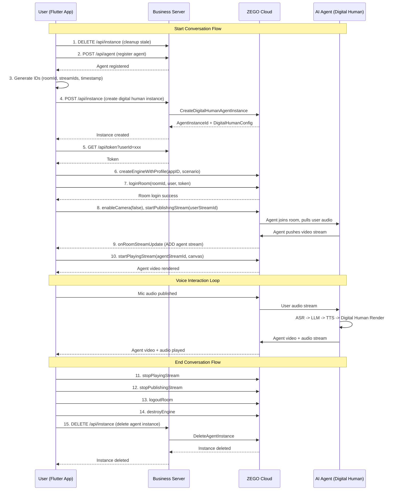

# AI Avatar Voice Interaction - Architecture Design

## Project Structure

```
examples/
├── server/                          # Existing Next.js server
├── flutter/                         # Flutter project
│   ├── lib/
│   │   ├── main.dart                # App entry + navigation
│   │   ├── login_page.dart          # Login page UI + logic
│   │   ├── main_page.dart           # Main page UI + ZEGO SDK calls + server API calls
│   │   └── zego_service.dart        # ZEGO Express SDK state holder (engine instance, stream IDs)
│   ├── android/
│   │   └── app/src/main/
│   │       └── AndroidManifest.xml  # Permissions: RECORD_AUDIO, INTERNET, etc.
│   ├── pubspec.yaml                 # Dependencies: zego_express_engine, http, flutter_dotenv
│   ├── .env                         # ZEGO_API_BASE_URL
│   ├── .env.example                 # Example env file
│   ├── interaction-design.md
│   ├── architecture-design.md
│   └── implementation-plan.md
```

## Architecture Diagram

```
+------------------+     +------------------+     +------------------+
|   Login Page     |     |    Main Page     |     |  Zego Service    |
|                  |     |                  |     |                  |
| - Username input |---->| - Video view     |---->| - Engine ref     |
| - Login button   |     | - Start/End btn  |     | - createEngine   |
|                  |     | - Mic toggle     |     | - loginRoom      |
+------------------+     | - Status text    |     | - publishStream  |
                         |                  |     | - playStream     |
                         | Server API calls |     | - cleanup        |
                         |------------------|     +------------------+
                         | registerAgent()  |            |
                         | createInstance() |            v
                         | getToken()       |     +------------------+
                         | deleteInstance() |     | ZEGO Express SDK |
                         +------------------+     | (Flutter Plugin) |
                                  |               +------------------+
                                  v                      |
                         +------------------+            v
                         |  Server (Next.js)|     +------------------+
                         |                  |     | ZEGO Cloud       |
                         | /api/agent       |---->| - RTC Rooms      |
                         | /api/instance    |     | - Stream routing |
                         | /api/token       |     | - AI Agent       |
                         +------------------+     +------------------+
```

## Sequence Diagram



## Key Design Decisions

1. **ZegoService as state holder**: The ZegoService class holds the ZEGO engine instance and provides direct SDK method calls. It is NOT an abstraction layer - MainPage calls ZegoService methods which directly call ZegoExpressEngine.instance methods.

2. **Stream ID consistency**: The timestamp used in userStreamId is generated once in MainPage and reused in both createInstance API call and startPublishingStream SDK call.

3. **TextureView rendering**: Use ZegoExpressEngine.instance.createCanvasView() which creates a Texture widget on Android.

4. **Server API calls**: All server API calls are made directly in MainPage using the http package. No separate API service class.

5. **Permission handling**: Use permission_handler package for runtime RECORD_AUDIO permission on Android.
